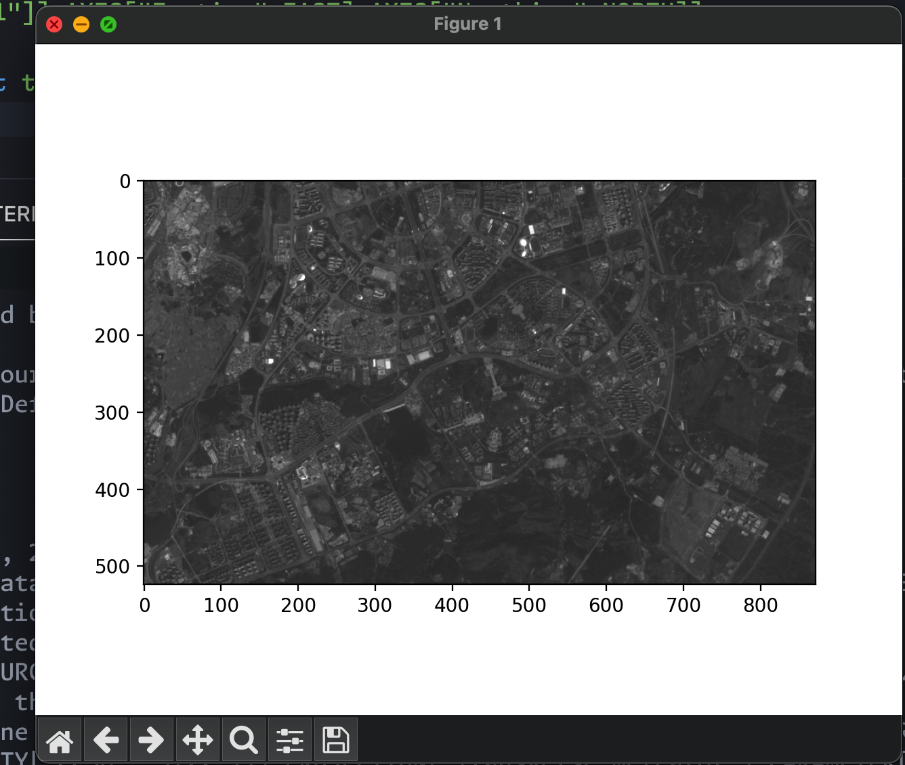

*ReadRaster.py*  
    Read A tiff file specified by the file_name 
    Show some basic info like bands count and projection.   
    then ask  *index* of a band to plot 


```python
import os
from osgeo import gdal
import numpy as np
import matplotlib.pyplot as plt
path_rsimg=input("enter the input filename");
dir_path = os.path.dirname(os.path.realpath(__file__))
path_rsimg=dir_path+"/"+path_rsimg;

dset = gdal.Open(path_rsimg)

x_size, y_size, num_band = dset.RasterXSize, dset.RasterYSize, dset.RasterCount  
print('xsize: %.0f, ysize: %.0f, num_band: %.0f' % (x_size, y_size, num_band))

print(str(dset.RasterCount)," bands");
num=input("input the band you wanna show")
num=int(num)
band = dset.GetRasterBand(num)        
band_array = band.ReadAsArray()     
print('shape of array:', band_array.shape)

geo_trans = dset.GetGeoTransform()  
print('geo_transform:', geo_trans)

proj = dset.GetProjection()         
print('projection:', proj)
plt.figure()
plt.imshow(band_array, vmax=4000, vmin=0, cmap='gray')
plt.show();

```
**Usage**: *Show specific band*
```bash
$ python ReadRaster.py 
enter the input filenamea.tif
xsize: 872, ysize: 524, num_band: 7
7  bands
projection: PROJCS["WGS 84 / UTM zone 48N",GEOGCS["WGS 84",DATUM["World Geodetic System 1984",SPHEROID["WGS 84",6378137,298.257223563]],PRIMEM["Greenwich",0],UNIT["degree",0.0174532925199433,AUTHORITY["EPSG","9122"]]],PROJECTION["Transverse_Mercator"],PARAMETER["latitude_of_origin",0],PARAMETER["central_meridian",105],PARAMETER["scale_factor",0.9996],PARAMETER["false_easting",500000],PARAMETER["false_northing",0],UNIT["metre",1,AUTHORITY["EPSG","9001"]],AXIS["Easting",EAST],AXIS["Northing",NORTH]]

input the band you wanna show:1

```

